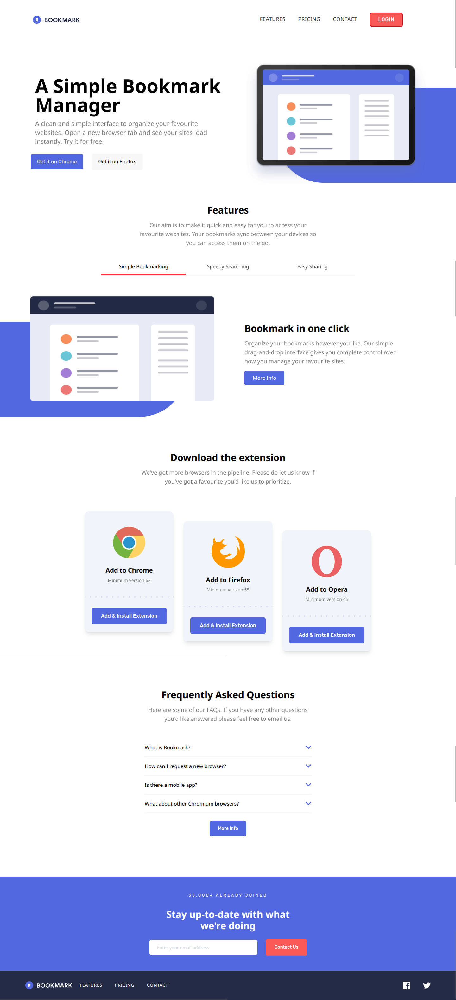
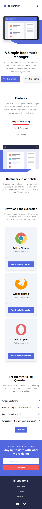

# Frontend Mentor - Bookmark landing page solution

This is a solution to the [Bookmark landing page challenge on Frontend Mentor](https://www.frontendmentor.io/challenges/bookmark-landing-page-5d0b588a9edda32581d29158). Frontend Mentor challenges help you improve your coding skills by building realistic projects.

## Table of contents

- [Getting Started](#getting-started)
- [Overview](#overview)
  - [The challenge](#the-challenge)
  - [Screenshot](#screenshot)
  - [Links](#links)
  - [Built with](#built-with)
- [Author](#author)

## Getting Started

This project uses [Tailwind CSS](https://tailwindcss.com) via npm. Make sure you have [Node.js](https://nodejs.org/) installed.

## Overview

### The challenge

Users should be able to:

- View the optimal layout for the site depending on their device's screen size
- See hover states for all interactive elements on the page
- Receive an error message when the newsletter form is submitted if:
  - The input field is empty
  - The email address is not formatted correctly

### Screenshots

| Desktop View                                     | Mobile View                                    |
| ------------------------------------------------ | ---------------------------------------------- |
|  |  |

### Links

> LiveSiteUrl: **Bookmark LandingPage** on [Vercel](https://bookmark-landing-page-six-jet.vercel.app//)

### Built with

- Semantic HTML5 markup
- Tailwind CSS
- Flexbox
- Grid
- Mobile-first workflow
- Javascript

## Author

- Frontend Mentor - [@ThyuHtooAungOwO](https://www.frontendmentor.io/profile/ThyuHtooAungOwO)
- X - [@PoungMont](https://x.com/Poung_Mont)
